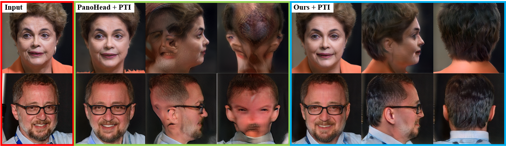

## SphereHead: Stable 3D Full-head Synthesis with Spherical Tri-plane Representation<br>
<a href="https://arxiv.org/abs/2404.05680"></a>
<a href="https://creativecommons.org/licenses/by/4.0"></a>
<a href="https://www.youtube.com/watch?v=jOwEflsQKq4"></a>
<a href="https://www.youtube.com/watch?v=jOwEflsQKq4"></a>  

<!--  -->


<!-- **SphereHead: Stable 3D Full-head Synthesis with Spherical Tri-plane Representation**<br> -->
Heyuan Li, Ce Chen, Tianhao Shi, Yuda Qiu, Sizhe An, Guanying Chen, Xiaoguang Han
<!-- <br>https://lhyfst.github.io/spherehead<br> -->

Abstract: *While recent advances in 3D-aware Generative Adversarial Networks (GANs) have aided the development of near-frontal view human face synthesis, the challenge of comprehensively synthesizing a full 3D head viewable from all angles still persists. Although PanoHead proves the possibilities of using a large-scale dataset with images of both frontal and back views for full-head synthesis, it often causes artifacts for back views. Based on our in-depth analysis, we found the reasons are mainly twofold. First, from network architecture perspective, we found each plane in the utilized tri-plane/tri-grid representation space tends to confuse the features from both sides, causing "mirroring" artifacts (e.g., the glasses appear in the back). Second, from data supervision aspect, we found that existing discriminator training in 3D GANs mainly focuses on the quality of the rendered image itself, and does not care much about its plausibility with the perspective from which it was rendered. This makes it possible to generate "face" in non-frontal views, due to its easiness to fool the discriminator. In response, we propose SphereHead, a novel tri-plane representation in the spherical coordinate system that fits the human head's geometric characteristics and efficiently mitigates many of the generated artifacts. We further introduce a view-image consistency loss for the discriminator to emphasize the correspondence of the camera parameters and the images. The combination of these efforts results in visually superior outcomes with significantly fewer artifacts.*


## Requirements

* We recommend Linux for performance and compatibility reasons.
* 1&ndash;8 high-end NVIDIA GPUs. We have done all testing and development using RTX3090 and A100 GPUs.
* 64-bit Python 3.8 and PyTorch 1.11.0 (or later). See https://pytorch.org for PyTorch install instructions.
* CUDA toolkit 11.3 or later.  (Why is a separate CUDA toolkit installation required?  We use the custom CUDA extensions from the StyleGAN3 repo. Please see [Troubleshooting](https://github.com/NVlabs/stylegan3/blob/main/docs/troubleshooting.md#why-is-cuda-toolkit-installation-necessary)).
* Python libraries: see [environment.yml](./environment.yml) for exact library dependencies.  You can use the following commands with Miniconda3 to create and activate your Python environment:
  - `cd SphereHead`
  - `conda env create -f environment.yml`
  - `conda activate SphereHead`


## Getting started

Download the whole `models` folder from [link]() and put it under the root dir.


## Generating samplings

```.bash
# Generate sampling videos using pre-trained model

python gen_videos.py --network models/spherehead-ckpt-025000.pkl --seeds 0-3 --grid 2x2 --outdir=output/videos --cfg Head --trunc 0.7

```

```.bash
# Generate sampling images using pre-trained model

python gen_samples.py --trunc=0.7 --seeds=1-10 --network models/spherehead-ckpt-025000.pkl --outdir=output/samples

```

## Applications
```.bash
# Generate full head reconstruction from a single RGB image.
# Please refer to ./gen_pti_script.sh
# For this application we need to specify dataset folder instead of zip files.
# Segmentation files are not necessary for PTI inversion.

sh gen_pti_script.sh
```

```.bash
# Generate full head interpolation from two seeds.
# Please refer to ./gen_interpolation.py for the implementation

python gen_videos_interp.py --network models/spherehead-ckpt-025000.pkl --trunc 0.7 --outdir=output/interpolations --num-keyframes=2 --seeds=2,3 --interpolate=true --cfg Head
```


## Data processing toolbox and WildHead dataset

We have developed a data processing toolbox designed to prepare 360 degree head images for training and testing. The toolbox is available at [chence17/WildHead.DatProc](https://github.com/chence17/WildHead.DatProc). Utilizing this toolbox, we constructed the WildHead dataset, which will be organized and released in the near future. Please refer to the paper and supplementary material for more details about the toolbox and dataset. If you believe any image in the dataset infringes on your privacy, please [contact us](heyuanli@link.cuhk.edu.cn) for immediate removal.


## Citation

If you find our repo helpful, please cite our paper using the following bib:

```
@misc{li2024spherehead,
    title={SphereHead: Stable 3D Full-head Synthesis with Spherical Tri-plane Representation},
    author={Heyuan Li and Ce Chen and Tianhao Shi and Yuda Qiu and Sizhe An and Guanying Chen and Xiaoguang Han},
    year={2024},
    eprint={2404.05680},
    archivePrefix={arXiv},
    primaryClass={cs.CV}
}
```

## Acknowledgements

This repo is heavily based off the [NVlabs/eg3d](https://github.com/NVlabs/eg3d) repo and the [SizheAn/PanoHead](https://github.com/SizheAn/PanoHead) repo; Huge thanks to the authors for their contributions!


